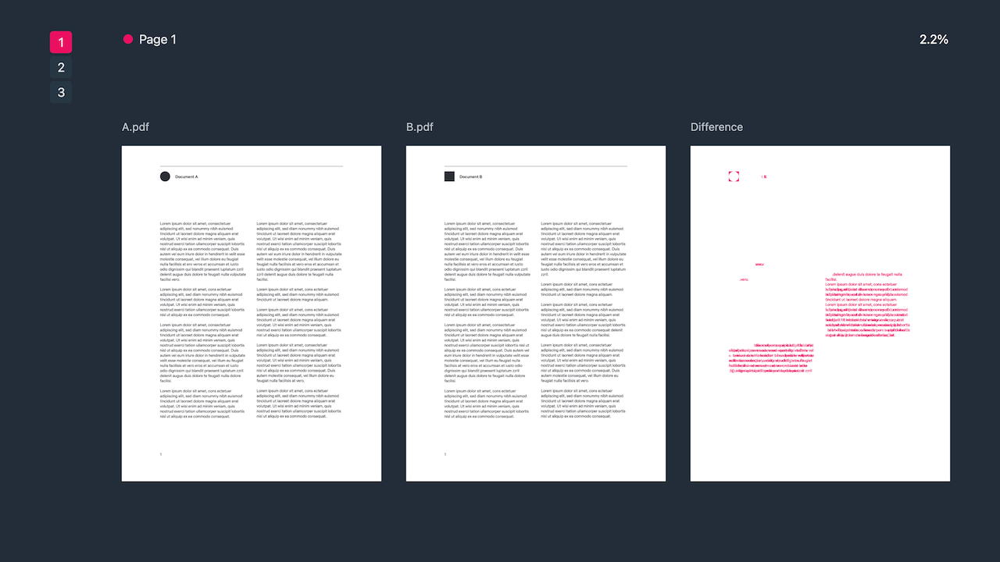

# Compare PDFs

Compare the pages of two PDF files side-by-side. Any differences between the two documents are highlighted in red. Each page is scored based on the number of pixels that differ.

Use the tool [here](https://pdfdiff.s-ings.com/).

Loosely based on [https://tools.simonwillison.net/compare-pdfs], but with the following features:

- Navigate quickly using the tab key
- Pages with differences are clearly highlighted
- Visualises relative differences between documents
- Centers documents of different sizes
- Responsive design
